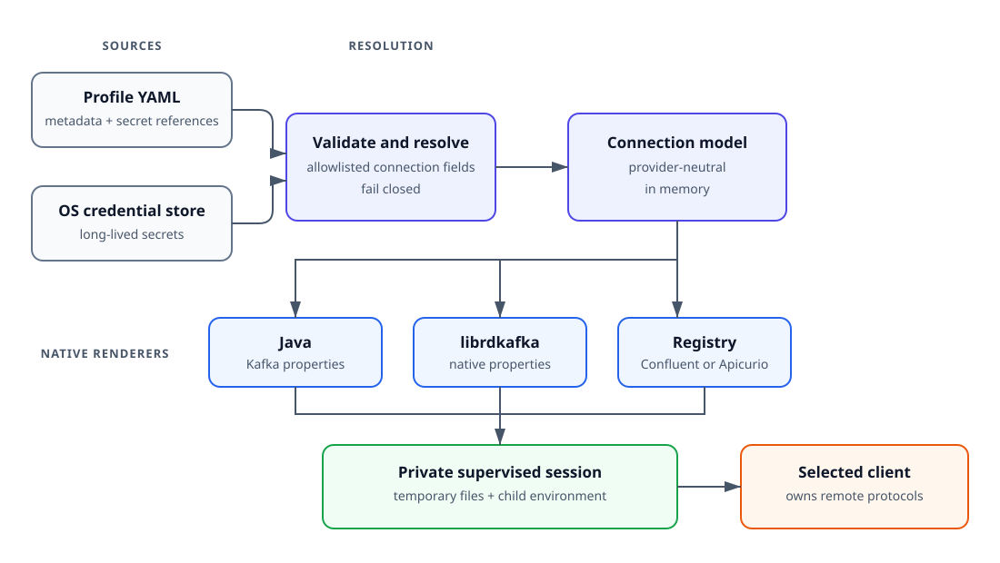
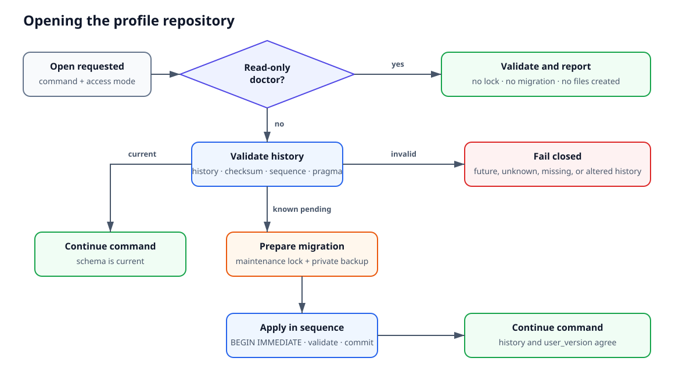
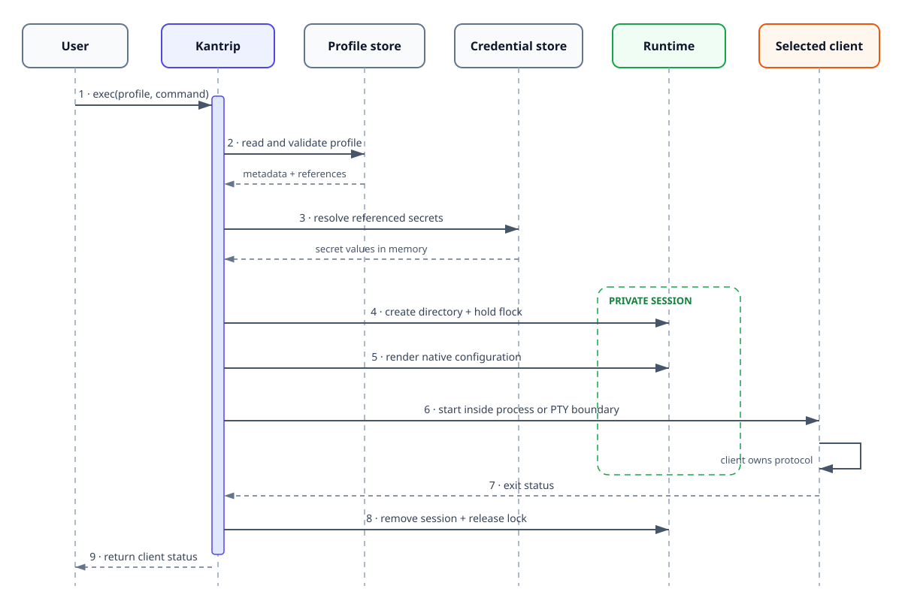
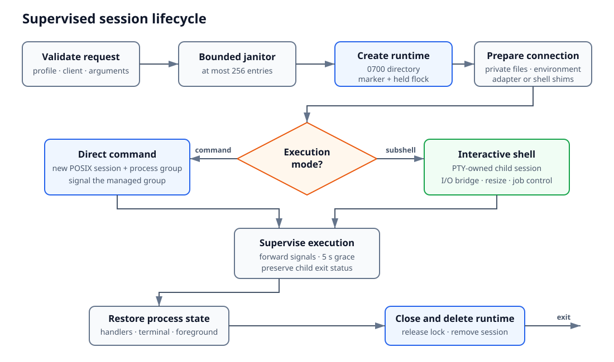
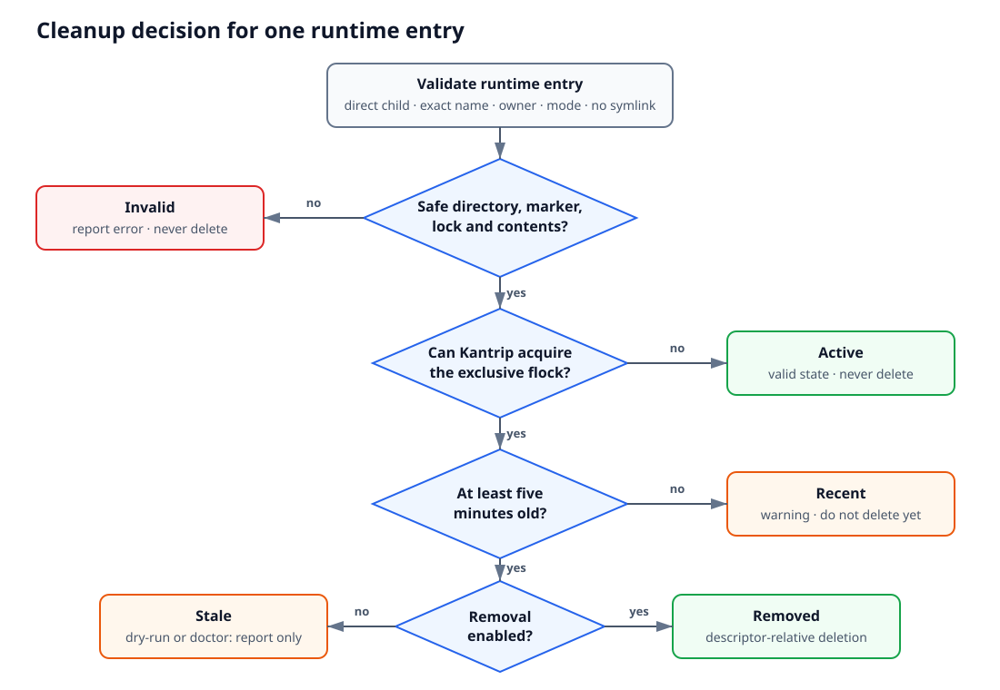

# MVP 1 Architecture

This document describes Kantrip's architecture after MVP 1: its boundaries,
security-relevant data flow, major components, strengths, and limitations.

Kantrip is not a persistent process manager, a global context selector, or a
replacement for Kafka clients. Its responsibility ends at storing profiles,
resolving secrets, generating temporary client configuration, and supervising
the active execution.

## Product boundary

For each command or subshell, the user selects a profile. Kantrip then:

1. Validates the profile and requested client.
2. Resolves referenced secrets from an approved operating-system store.
3. Builds a provider-neutral connection model.
4. Renders the native connection properties required by the client.
5. Supervises the client in a bounded session.
6. Removes session-owned connection material.

Kantrip prepares the connection for one execution; it does not perform the
Kafka or Registry operation itself. It does not install or replace clients,
manage topics, groups, or schemas, or keep a globally active profile. The
selected client performs the requested operation using the connection material
Kantrip supplies for that session.

## Command surface

The CLI follows one resource-oriented lifecycle. `add` creates a profile,
`edit` changes it, `remove` deletes it, `list` selects profiles, and `describe`
inspects one safely. `doctor`, `ping`, `exec`, and `current` retain their
diagnostic, connectivity, execution, and session roles.

External documents are explicit input sources for `add`, and prompted secret
replacement belongs to `edit`. Kantrip has no separate `import`, `secret`,
`export`, `clone`, or `configure` command family. Human, JSON, and YAML
inspection are observations rather than round-trip profile documents; they omit
secret values and internal credential references. The exact planned CLI
contract remains centralized in [MVP.md](MVP.md).

## Data flow

Manual profile fields and external input sources converge on the same validated
connection model. Each renderer translates that model into one client's native
configuration; diagnostics reuse the same resolution path.

## Profiles and connection material

Profiles are schema-validated JSON documents stored one per row in a private
SQLite database. Each has an immutable UUID, Kafka connection metadata, and at
most one independent Registry connection. Documents contain non-secret values
and opaque secret references, never credentials, bearer tokens, raw JAAS, or
private keys.

Database lookup follows `KANTRIP_DATABASE`, `XDG_DATA_HOME`, then
`~/.local/share/kantrip/profiles.db`. Its directory is user-owned mode `0700`;
the database and SQLite sidecars are mode `0600`. Symlinks, unsafe ownership or
permissions, corrupt schemas, and unsupported internal versions fail closed.
WAL permits readers while writes are serialized with bounded
`BEGIN IMMEDIATE` transactions. The profile document schema is independent of
the internal database schema version.

Long-lived secrets use immutable
`profile/<profile-uuid>/<credential-uuid>/<field>` keys in macOS Keychain or a
Linux Secret Service-compatible backend. The credential UUID changes on every
replacement, so staging never overwrites the value referenced by the usable
profile. Kantrip rejects unavailable, plaintext, encrypted-file, null, and
unknown backends instead of weakening storage.

The implemented connection model supports plaintext transport and
server-authenticated TLS with default client or profile trust, currently without
Kafka authentication. The remaining model adds SASL/PLAIN, SCRAM-SHA-256,
SCRAM-SHA-512, mutual TLS, and OAuth 2.0 client credentials. A Registry remains
an independent connection; Kafka and Registry credentials are never inherited
across those boundaries.

## Schema evolution and maintenance

Kantrip owns a linear migration history inside the profile database. The engine
executes immutable `SqlMigration` commands registered explicitly in one
`MigrationChain`; it does not discover modules or files dynamically. Each
command has one positive integer `sequence`, which is both its identity and
order, plus an immutable name and SQL payload. Its checksum covers all three.
The history records when it ran and which Kantrip version applied it, but
product SemVer does not identify or order migrations. A release may contain
zero, one, or several migration commands.

The initial SQLite profile store is migration sequence `1`; sequence `2` adds
the credential reconciliation journal. New databases apply the complete bundled
chain. Databases from published releases apply each pending migration in
ascending order before a profile-dependent command continues. An unreleased
database shape receives no compatibility path: every non-empty database without
migration history fails closed. There is no YAML migration path and no
user-facing migration command or script.

`schema_migrations` is authoritative and `PRAGMA user_version` mirrors its
highest applied sequence. Missing or duplicate sequences, an altered checksum,
an unknown applied migration, a newer sequence, or disagreement with the pragma
fails closed. Applied migrations are never edited or renumbered; corrections
roll forward through a new sequence.

Pending work acquires the cross-process maintenance lock and creates one private
consistent backup before applying the pending chain. Its name is
`profiles.db.pre-migration-<UTC timestamp>-<unique id>`, so a later migration
never overwrites an earlier recovery point. Schema changes run inside a bounded
`BEGIN IMMEDIATE` transaction. Kantrip updates the history and pragma only with
the schema change, validates the result before commit, retains every backup, and
never downgrades a database.

A normal `doctor` run opens storage read-only and reports pending work without
creating files. `doctor --repair` is the single explicit operational workflow:
under one lock it migrates, validates, reconciles exact credential-journal
records, removes validated stale sessions, and diagnoses the resulting state.
It never guesses how to repair corrupt, ambiguous, active, recent, or externally
owned objects.

## Connection-only configuration

Profiles describe connections: endpoints, transport security, server
verification, client identity, credential acquisition, and authentication
routing. They exclude producer, consumer, topic, group, serializer, retry,
cache, telemetry, schema-selection, and other application behavior.

Every stored Registry connection names its provider explicitly. The CLI may
select Confluent as a convenience default, but it persists that choice rather
than relying on schema normalization or read-time inference.

Input handlers allowlist connection properties and report ignored property
names without their values. Unknown security-like settings, conflicting aliases,
and options that disable certificate or hostname verification fail closed.

Renderers produce native Java, librdkafka, Confluent Schema Registry, and
Apicurio configurations. They use documented properties such as
`sasl.oauthbearer.token.endpoint.url`, `bearer.auth.issuer.endpoint.url`, and
`apicurio.registry.auth.service.token.endpoint`; source files are never replayed
as unvalidated configuration.

## Profile lifecycle and input sources

Profile mutations share validation, cross-store locking, secret staging,
transactional database updates, and reconciliation. `edit` may add or update a
Registry; only an explicit removal deletes it. Existing secrets have explicit
keep, replace, and remove semantics and are never displayed or prefilled.

The reusable cross-store transaction engine lives in
`kantrip/credential_mutations.py`. Authentication-specific profile fields and
commands build on this engine; they do not implement their own keyring or
journal sequence.

SQLite and the credential store cannot participate in one atomic transaction.
Kantrip therefore stores non-secret exact-delete records in
`credential_reconciliation` and uses immutable secret references to make
partial failures recoverable. The journal never stores a value and never asks a
backend to enumerate credentials:

- Commit cleanup intent before a credential-store write can create an orphan.
- Stage new secrets under new references.
- Atomically switch the profile document and advance its journal record in one
  SQLite transaction.
- On a failed database update, remove staged secrets and retain the old profile.
- Delete superseded secrets only after the profile switch, retaining failed
  cleanup work for idempotent retry by a mutation or `doctor --repair`; a normal
  `doctor` run only reports the pending record.

Each profile row has a stable UUID, a unique name, and a monotonically
increasing revision. The revision is a generation and concurrency token, not
retained history. Interactive secret edits collect and validate input without
holding the maintenance lock, then reload the profile under the lock and update
only if its expected UUID and revision still match. A mismatch safely abandons
or journals staged credentials and requires a retry; it never overwrites a
concurrent change.

Java, librdkafka, and Confluent-generated properties, plus Kubernetes Secrets
generated for Strimzi KafkaUsers, enter the same profile model through
`add`. Format-specific handlers extract supported secrets before commit and
never modify the source. A `KafkaUser` custom resource is not a credential
source; Kantrip accepts the generated same-named Secret. Private vendor CLI
files and Kubernetes discovery are outside this boundary.

## Session resolution and rendering

Secret resolution creates one in-memory session model. Renderers derive all
client files from it; adapters cannot query the credential store independently.

Generated properties, custom CA bundles, certificates, private keys, adapter
files, and shims live only in the private session directory. A selected Kafka
CA bundle is validated and copied into the profile as public material, then
materialized privately for Java and librdkafka clients. Secrets do not appear
in child arguments, diagnostics, snapshots, or normal output.

Custom CA profiles use native PEM properties in librdkafka. Java adapters first
verify Apache Kafka 2.7+ or Confluent Platform 6.1+, the releases that introduced
PEM trust-store support. Older or unidentifiable Java clients fail before the
Kafka operation instead of attempting an incompatible or weaker configuration.

Java and librdkafka OAuth use their verified native client-credentials flows.
Kantrip supplies native connection properties but does not implement token
refresh.

## Client adapters

An adapter recognizes the executable, checks its version and required profile
capabilities, rejects connection overrides, and injects native configuration.
Unsupported or ambiguous combinations fail before execution.

MVP 1 adapters cover Apache and Confluent Kafka commands, Confluent Schema
Registry consoles, `kcat`/`kafkacat`, Kaskade, `kcl`, and `kafkactl`. The exact
version and feature matrix lives in [COMPATIBILITY.md](COMPATIBILITY.md).

Interactive Bash, Zsh, and Fish sessions use temporary shims. The shell keeps
its startup files and history, while Kantrip neutralizes aliases, functions,
and abbreviations that would bypass an adapter. No persistent shell or Kafka
installation changes are made.

## Process supervision and cleanup

### Execution sequence

The profile store and credential store are read before session files exist.
Only the selected client receives the rendered connection material, and the
runtime is removed after supervision ends.

### Session lifecycle

Before starting a child, `exec` validates the request, runs the bounded janitor,
creates and locks a private runtime session, renders configuration, and prepares
the adapter. The marker changes from `preparing` to `running` only after
preparation succeeds. Every exit path closes the lock and removes the owned
session when possible.

### Process and terminal boundary

Direct commands run in a new POSIX session and process group, allowing Kantrip
to signal descendants that remain within the managed boundary. Interactive
Bash, Zsh, and Fish shells run in a PTY-owned child session; Kantrip bridges I/O
and window-size changes while the PTY preserves job control.

The supervisor forwards SIGINT, SIGTERM, and SIGHUP. The first signal starts a
five-second grace period; another signal or expiration sends SIGKILL. Normal
exit codes are preserved and signal `N` maps to `128 + N`.

When control returns to Kantrip, it restores signal handlers, terminal
attributes, and foreground ownership. A supervisor SIGKILL, host failure, or
power loss can prevent restoration and leave the runtime session for recovery.

The child receives only Kantrip session metadata and adapter-specific
connection variables. Conflicting inherited Kafka and Registry values are
removed from the child environment; the caller's environment is unchanged.

### Runtime identity and liveness

Kantrip uses `$XDG_RUNTIME_DIR/kantrip/sessions` when the base directory is
absolute, real, user-owned, and mode `0700`; otherwise it uses
`<system-temp>/kantrip-<uid>/sessions`. An existing unsafe managed root blocks
execution.

Managed directories use mode `0700`. Each direct child is named
`session-<32-lowercase-hex-id>` and contains owner-only connection material,
`session.lock`, and `session.json`. The marker contains only the session ID,
owner UID, supervisor PID, creation time, lifecycle state, profile ID, and
profile revision. A running session remains pinned to the revision from which
its private configuration was generated; later profile edits affect only later
sessions.

Kantrip holds an exclusive `fcntl.flock` for the session lifetime. The kernel
lock, not the recorded PID, establishes liveness. A crash releases the lock even
when it leaves the directory behind.

### Recovery

Runtime entries are classified as follows:

| State | Meaning | Cleanup action |
| --- | --- | --- |
| `active` | Valid and locked | Keep |
| `recent` | Valid, unlocked, younger than five minutes | Keep |
| `stale` | Valid, unlocked, at least five minutes old | Eligible |
| `removed` | Stale and deleted | None |
| `invalid` | Failed structural or security validation | Report, never delete |
| `failed` | Safe candidate could not be deleted | Report |

The lock is authoritative; age only protects a newly unlocked or partially
initialized session from immediate deletion. Invalid entries remain untouched.

The automatic janitor scans at most 256 direct entries before `exec`. A normal
`doctor` run previews the complete classification without changing it;
`doctor --repair` removes every valid stale session it can safely process.
Repair returns nonzero for unsafe roots, invalid entries, incomplete scans,
deletion failures, or any other remaining error. Active and recent sessions are
not errors.

Deletion is descriptor-relative. Before removing a direct child, Kantrip
validates its name, owner, modes, marker, lock, age, contents, and inode; it
rejects symlinks and path replacement. The same lock prevents concurrent
cleaners from deleting an active session.

The doctor scanner treats active sessions as valid, recent or stale entries as
warnings, and unsafe state as errors. Runtime paths appear only with
`--verbose`.

Nested sessions and processes that escape through `setsid` or daemonization are
unsupported. Kantrip exposes no persistent background-session API.

## Diagnostics and output

`doctor` validates migration state, profiles, permissions, credential-store
availability, secret references, reconciliation state, certificates, runtime
sessions, and installed client capabilities without resolving values for
display. Its default mode is always read-only; `--repair` explicitly enables
only the deterministic maintenance sequence described above.

`doctor PROFILE --sessions` filters validated active, recent, and stale session
observations by stored profile ID and reports their captured profile revision.
It never infers ownership from generated client configuration or exposes its
private paths or contents.

`ping` reuses normal connection construction for bounded Kafka metadata and
provider-specific Registry requests. Its result is limited to the operation it
performed; it does not imply broader topic, group, schema, or administrative
authorization.

Kantrip writes results to stdout and diagnostics to stderr. Sensitive values
are classified and redacted before presentation, and color never carries
meaning.

## Architectural strengths

- Explicit profile selection prevents ambient context drift.
- Long-lived secrets remain outside the profile database and are resolved only
  for the selected execution.
- One typed model and native renderers prevent dialect mixing and arbitrary
  configuration passthrough.
- Capability checks fail before unsupported authentication can degrade.
- Immutable references and reconciliation preserve a usable profile across
  partial credential-store failures.
- Ordered migrations, immutable checksums, backups, and fail-closed history
  validation make local schema evolution auditable and recoverable.
- Process boundaries, liveness locks, and recovery give temporary secrets a
  bounded lifecycle.
- Native clients retain protocol handling and OAuth refresh.

## Architectural limitations and tradeoffs

- Kantrip is a credential-delivery boundary, not a sandbox. The selected client,
  descendants, and shell startup code can read material supplied to them.
- Same-user compromise, malicious executables, compromised credential stores,
  kernel compromise, or administrator access defeat local controls.
- Secrets temporarily exist in memory and sometimes private files; deletion is
  not forensic erasure.
- SQLite and credential-store updates are recoverable, not atomic. Loss of both
  journal and referenced state can leave undiscoverable orphans.
- Schema migrations are forward-only. An older Kantrip binary cannot open a
  database containing migrations it does not recognize.
- Compatibility depends on external client interfaces and tested versions.
- Profiles intentionally exclude application behavior and topic-dependent
  schema configuration.
- Linux and macOS are supported. Windows, Amazon MSK IAM, the Strimzi OAuth
  module, HTTP proxy profiles, Kubernetes discovery, and managed background
  sessions are outside MVP 1.
