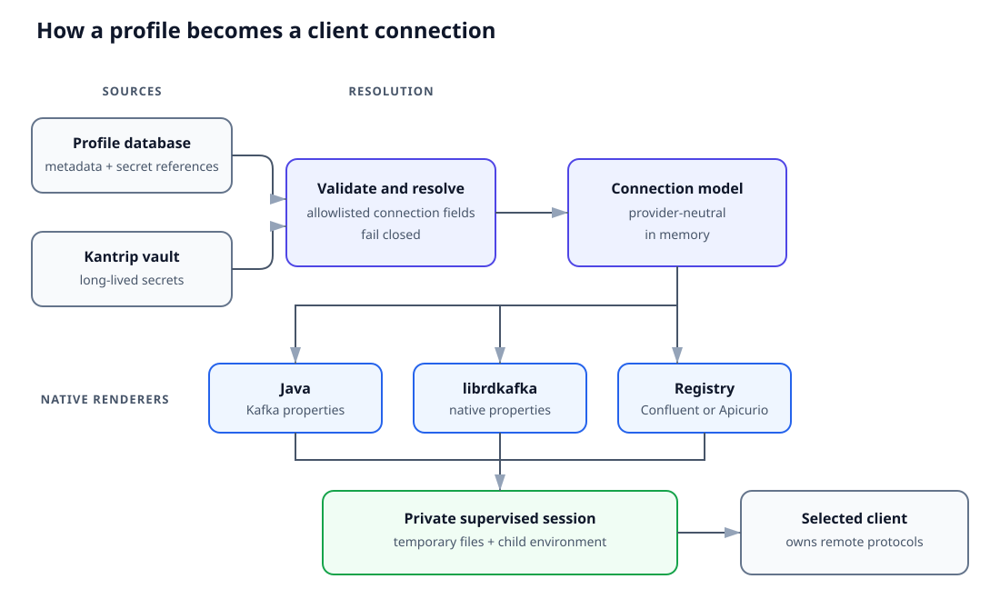
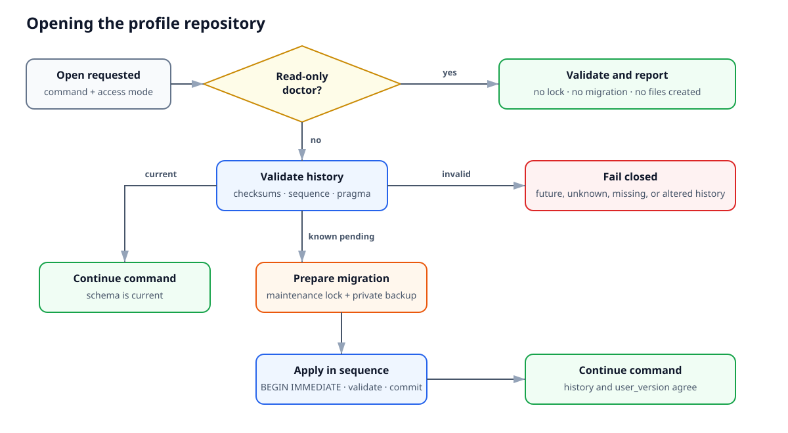
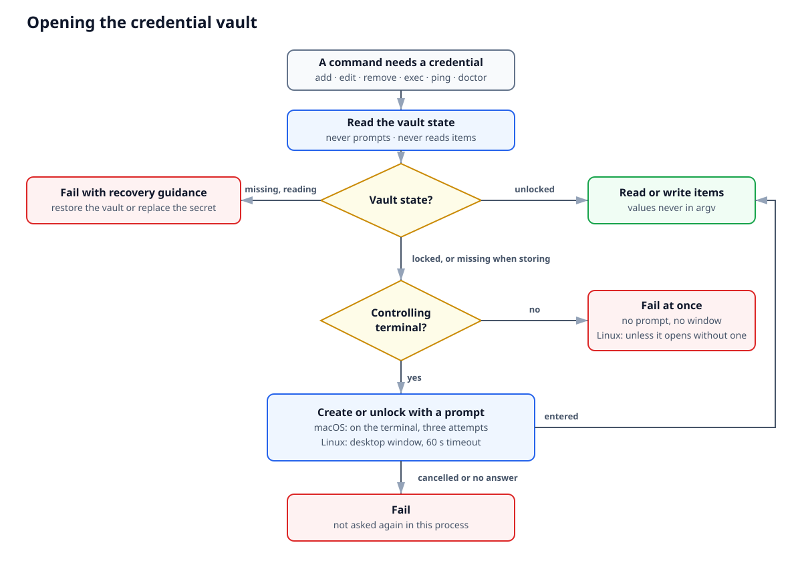
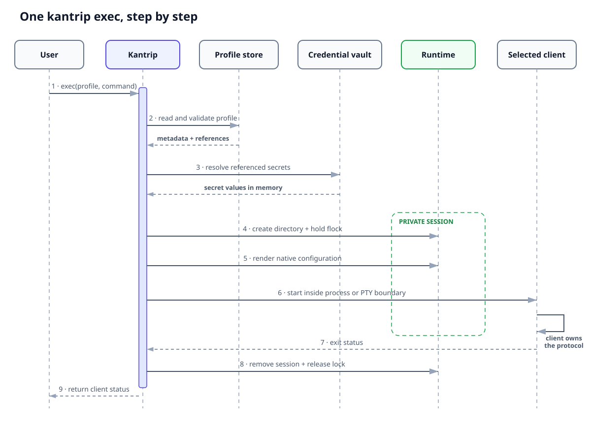
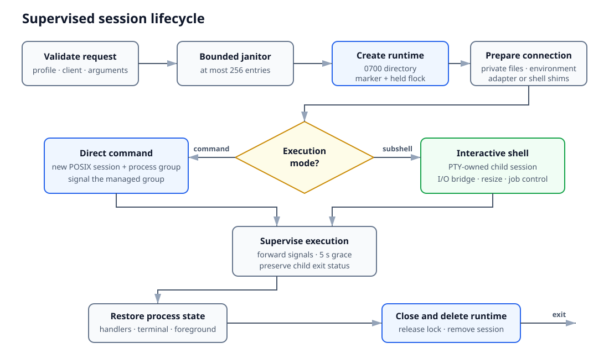
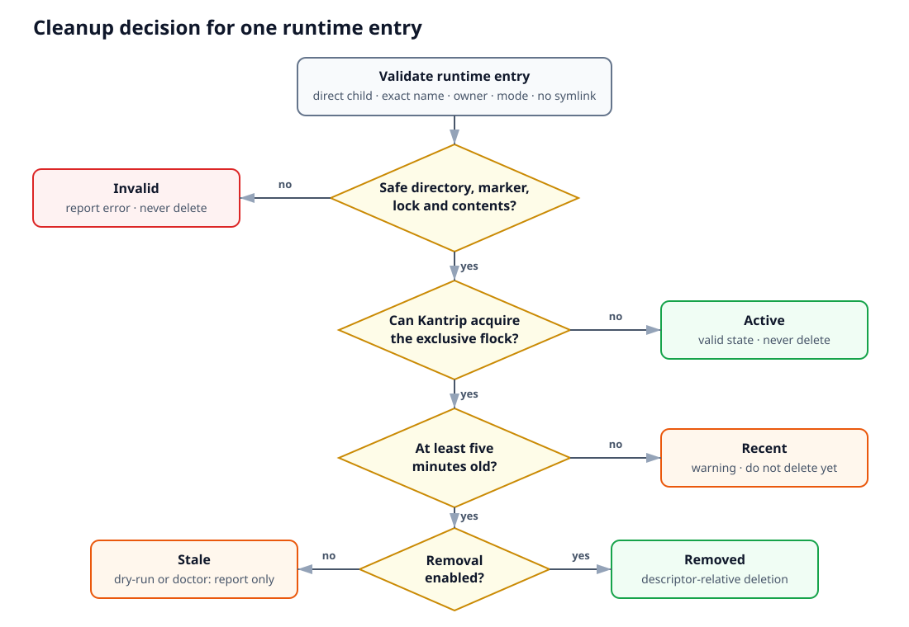

# Architecture

How Kantrip is built and why. This guide records the implemented design, its
technical decisions, and its limits; [Compatibility](COMPATIBILITY.md) owns the
exact client and version matrix, and [Threat Model](THREAT_MODEL.md) the
security analysis. Planned work lives in the
[v0.1](https://github.com/sauljabin/kantrip/milestone/1) milestone.

## Contents

- [Overview](#overview)
  - [Design rules](#design-rules)
  - [Out of scope](#out-of-scope)
- [Code map](#code-map)
- [Profiles and storage](#profiles-and-storage)
  - [Schema migrations](#schema-migrations)
  - [Profile mutations](#profile-mutations)
- [Credential vault](#credential-vault)
  - [macOS keychain vault](#macos-keychain-vault)
  - [Linux Secret Service vault](#linux-secret-service-vault)
  - [Vault errors and diagnostics](#vault-errors-and-diagnostics)
- [Sessions and rendering](#sessions-and-rendering)
- [Client adapters](#client-adapters)
- [Process supervision](#process-supervision)
  - [Process and terminal boundary](#process-and-terminal-boundary)
  - [Runtime sessions and recovery](#runtime-sessions-and-recovery)
- [Diagnostics](#diagnostics)
- [Verification](#verification)
- [Strengths and limitations](#strengths-and-limitations)

## Overview

For each command or subshell, the user names a profile. Kantrip then:

1. Loads one profile generation (UUID and revision) and resolves its Kafka and
   Registry credentials through one vault, under one maintenance lock.
2. Builds a validated plaintext or verified-TLS connection model in memory.
3. Renders the native configuration each client needs.
4. Supervises the client in a private, bounded session.
5. Removes the session's connection material.

The resolved snapshot is released from the lock before rendering or any
network call, so a later edit or removal cannot mix generations or invalidate
credentials already in memory. Adapters and shims never read SQLite or the vault
again during that session.

Kantrip prepares the connection; the selected client performs the Kafka or
Registry operation. The CLI is resource-oriented: `add`, `edit`, `remove`,
`list`, and `describe` manage profiles; `doctor`, `ping`, `exec`, and `current`
diagnose, probe, run, and report sessions. Human, JSON, and YAML output are
observations, never round-trip documents, and omit secret values and internal
references.

### Design rules

These rules bound every feature and are checked before an operation starts:

- **Explicit selection.** Every network command names `PROFILE`; there is no
  globally active profile.
- **No secrets in arguments.** Secrets enter only through no-echo prompts or
  bounded private-key files; no flag accepts a password, token, client secret,
  private key, or JAAS value.
- **Verified TLS for authentication.** Authenticated Kafka, Registry, and OAuth
  token endpoints require verified TLS, including on localhost. Plaintext is
  allowed only without authentication.
- **Independent trust and credentials.** Kafka, Registry, and token-endpoint
  trust and credentials are configured separately and never inherited.
- **Typed fields only.** Profiles accept no arbitrary Java or librdkafka
  property maps; only typed connection fields reach the renderers.
- **Capability checks name the gap.** An unsupported client and mechanism
  combination fails before the operation, naming both. Library support does not
  imply that a CLI built on it exposes the setting.

### Out of scope

Profiles describe connections only: endpoints, transport security, server
verification, client identity, and credential acquisition. They exclude
producer, consumer, topic, group, serializer, retry, and schema-selection
behavior.

Kantrip does not provide database downgrades, profile history, secret retrieval,
round-trip export, detached or background sessions, Kubernetes discovery,
arbitrary secret providers, Kafka fixed-token or refresh-token OAuth,
client-side Strimzi OAuth callbacks, Windows, JKS/PKCS12 conversion, HTTP proxy
profiles, a daemon, a programmatic profile API, or a TUI. Adapters exist only
for clients with a versioned, tested contract.

## Code map

| Area | Modules | Responsibility |
| --- | --- | --- |
| CLI | `cli.py`, `cli_options.py`, `cli_inputs.py`, `console.py`, `profile_output.py`, `redaction.py` | Commands and presentation; `add`/`edit` options declared once per field; typed inputs and no-echo secret prompts; safe observations |
| Profiles | `profiles.py`, `profile_storage.py`, `profile_auth.py`, `profile_documents.py` | Mutation orchestration and snapshot resolution; SQLite paths, locks, and loading; pure authentication and document planning |
| Consistency | `credential_mutations.py`, `mutation_outcomes.py`, `reconciliation.py`, `migrations.py`, `maintenance.py` | Cross-store staging and retirement; commit classification; the cleanup journal; the migration chain; `doctor --repair` |
| Credentials | `secret_store.py`, `macos_vault.py`, `linux_vault.py`, `secret_value.py` | The `SecretStore` protocol and its two vaults; `Secret`, which never renders itself |
| Connections | `kafka.py`, `registry.py`, `oauth.py` | Validated connection models and canonical properties |
| Sessions | `session.py`, `runtime.py`, `supervisor.py`, `shells.py`, `_files.py` | Session preparation, private runtime directories and cleanup, process and PTY supervision, shell setup |
| Adapters | `adapters.py`, `adapter_policy.py`, `adapter_shims.py`, `_adapter_guard.py` | One descriptor per client family; native argument grammars; shims; the shim-side argument guard |
| Diagnostics | `doctor.py`, `ping.py` | Read-only checks; bounded connectivity probes |

## Profiles and storage

Profiles are schema-validated JSON documents, one per row in a private SQLite
database. Each has an immutable UUID, a unique name, a revision, Kafka
connection metadata, and at most one Registry. Documents hold non-secret values
and opaque secret references, never credentials, tokens, raw JAAS, or private
keys. The bundled [profile schema](schemas/profile.schema.json) and
[example](examples/profile.json) define stored documents, not a file-import
format; documents omit application versions, and SQLite has its own schema
version.

Each Registry names its provider explicitly: `confluent`
(`schema.registry.url`) or `apicurio` (`apicurio.registry.url`, native
`/apis/registry/v3`; its `/apis/ccompat/v7` API needs a Confluent profile).
`add --registry-url` persists Confluent when no provider is given, so reads
never infer one. Both follow the official
[Confluent](https://docs.confluent.io/platform/current/schema-registry/fundamentals/serdes-develop/index.html)
and [Apicurio](https://www.apicur.io/registry/docs/apicurio-registry/3.3.x/getting-started/assembly-configuring-kafka-client-serdes.html)
serializer contracts.

The database path is `KANTRIP_DATABASE`, then `XDG_DATA_HOME`, then
`~/.local/share/kantrip/profiles.db`. The directory is user-owned mode `0700`;
the database and its sidecars are `0600`. Symlinks, unsafe ownership or
permissions, corrupt contents, and unsupported versions fail closed. WAL lets
readers run while writes are serialized by bounded `BEGIN IMMEDIATE`
transactions. Every writable connection verifies WAL and FULL synchronization
(`fullfsync` on macOS), and new directory entries are `fsync`ed before success
is acknowledged. This assumes a local filesystem, not a network or
cloud-synchronized directory.

### Schema migrations

The database carries a linear migration history. Each migration is an immutable
`SqlMigration` registered explicitly in one `MigrationChain`, with no module or
file discovery. Its positive integer `sequence` is both identity and order; its
checksum covers the sequence, name, and SQL. The history also records when each
migration ran and which Kantrip version applied it, but product versions never
identify or order migrations, and a release may carry any number of them.
Sequence `1` is the initial store and `2` adds the credential reconciliation
journal.

`schema_migrations` is authoritative, and `PRAGMA user_version` mirrors its
highest sequence. Gaps, duplicates, changed checksums, unknown or newer
migrations, and pragma disagreement fail closed; corrections roll forward as new
sequences. A database without history, or any former YAML store, is rejected:
no unreleased format gets a compatibility path.

Pending work takes the cross-process maintenance lock, writes a private backup
named `profiles.db.pre-migration-<UTC timestamp>-<unique id>` through SQLite's
online backup API (so no earlier recovery point is overwritten), and applies the
chain in one bounded transaction that updates schema, history, and pragma
together. Backups are recovery snapshots; restoring one is a manual operation.
A normal `doctor` opens storage read-only and only reports pending work.

### Profile mutations

SQLite and the vault cannot share one atomic transaction, so every
secret-bearing change goes through the engine in `credential_mutations.py`,
built on immutable references `profile/<profile-uuid>/<credential-uuid>/<field>`.
The credential UUID changes on every replacement, so staging never overwrites
the value the current profile uses:

1. Journal cleanup intent in `credential_reconciliation` before a vault write
   can create an orphan. The journal never stores a value and never asks the
   vault to enumerate entries.
2. Stage new secrets under new references and read each back.
3. Switch the profile document and its journal record in one SQLite
   transaction, with an expected revision so a concurrent change is rejected.
4. Delete superseded secrets only after the switch; failed deletions stay
   journaled for a later mutation or `doctor --repair`.

Each mutation ends in one explicit state: not committed (exit `1`), committed
with cleanup or verification pending (`3`), or unknown (`4`). An exception is
never taken as proof of rollback: if `COMMIT` raises, Kantrip keeps the lock,
reopens the database read-only, and compares the exact name, UUID, revision,
document, and owned journal records. A mutation reconciles only the records it
created, after validating the whole journal against live references; older
debt stays for repair.

`edit` changes only explicit fields and keeps the UUID. Stored authentication
fields carry over only while the authentication type is unchanged, and a
Registry provider change keeps authentication only when the new provider
supports it. Prompts and file reads happen before the lock. Backups hold
references, not credentials, so restoring SQLite alone cannot restore retired
vault values.

## Credential vault

Each platform keeps credentials in one dedicated vault named `kantrip`, which
does not unlock with the login session. The operating system owns the vault
password; Kantrip never reads, stores, or passes it. Both vaults implement the
same `SecretStore` protocol, store each item under service `kantrip` and account
(or attribute) equal to its reference, read the vault state before any item
access without prompting, and open the vault only when a command needs a
credential. Labels read `Kantrip kafka/password (profile UUID)`; labels and
accounts never carry a secret.

A missing vault cannot be told from missing items by item reads, which is why
the state is checked first, and a replaced vault reads as missing secrets.
`delete` from a missing vault succeeds, because no secret outlives its vault.
A refused, cancelled, or unanswered prompt is final for the process, so a
command that resolves several credentials asks at most once.

### macOS keychain vault

The vault is `~/Library/Keychains/kantrip.keychain-db`, the same
dedicated-keychain model as aws-vault. `security create-keychain` and
`security unlock-keychain` prompt on the controlling terminal (`/dev/tty`).

- **Items go through `/usr/bin/security` only.** macOS stamps each item with a
  partition from the creating binary's signature. Homebrew and uv Pythons are
  ad-hoc signed, so items created in-process would prompt after every Python
  upgrade; items written by `security` get the stable `apple-tool:` partition.
  Writes send `add-generic-password -U … -X <hex>` lines to `security -i` on
  stdin, so values never reach argv; reads parse `find-generic-password -g`.
- **Values are split.** `security -i` truncates lines at about 4,094 bytes and
  runs the rest as new commands, so values are split below a 4,000-byte line
  budget. The head item holds the first piece and the piece count; pieces are
  `reference#1`, `reference#2`, and so on. One batch writes pieces first and the
  head last, and any unexpected stderr fails the write, because `security -i`
  exits 0 even when a command fails.
- **State reads never prompt.** `SecKeychainGetStatus` (through ctypes) neither
  prompts nor resets the idle timer. Reading a locked vault with `security`
  would open a password window, so Kantrip never does it.
- **Creation** refuses an empty password (deleting the new vault), sets
  `-l -u -t 900` because new keychains lock after five minutes, and adds the
  vault to the search list so Keychain Access shows it.
- **Unlocking** allows three attempts (exit status 51 is a wrong password);
  Ctrl-C leaves the vault locked and reports a cancellation.

File keychains and `SecKeychain*` are deprecated but work on macOS 27; the macOS
CI job would show their removal.

### Linux Secret Service vault

The vault is one Secret Service collection labeled `kantrip`, reached over D-Bus
with `secretstorage`. Kantrip identifies the provider from the process that owns
`org.freedesktop.secrets` and accepts only GNOME Keyring and KDE Wallet
(`ksecretd`, `kwalletd5`, `kwalletd6`). It was measured on GNOME Keyring 50
(Ubuntu 26.04), KDE Frameworks 6.24 (Kubuntu 26.04), and GNOME Keyring 46 under
COSMIC (Pop!_OS 24.04).

- **Lookup never prompts.** GNOME accepts only the `default` alias and derives
  object paths from keyring file names, so the vault is
  `/org/freedesktop/secrets/collection/kantrip` (from `kantrip.keyring`) with the
  label `kantrip`; Kantrip refuses to guess between same-label keyrings. KDE is
  found by the alias `kantrip` only, because a deleted wallet leaves a
  same-label ghost until `ksecretd` restarts, and only while its
  `kwalletd/kantrip.kwl` file exists: KDE keeps listing a wallet whose file is
  gone, and unlocking it would start the create wizard and then read stale
  items as empty secrets. Every read rejects empty secrets.
- **Values are not split.** D-Bus has no line limit; 1 MB values round-trip.
- **Windows are bounded.** The provider shows a window only when its prompt
  runs. An unanswered window blocks forever and stays on screen, so Kantrip
  waits at most 60 seconds, then calls `Prompt.Dismiss()`; Ctrl-C dismisses it
  too. A prompt dismissed within a second was never shown (no display over SSH,
  a locked GNOME screen), and Kantrip asks for an unlocked desktop session.
- **No terminal, no window.** Without a controlling terminal, Kantrip still calls
  `Unlock`: if no prompt is needed, the vault is used; otherwise the unshown
  prompt is dismissed and the command fails at once.
- **Opened without a window.** `Unlock` needs no prompt when the vault has an
  empty password or GNOME's "Automatically unlock this keyring whenever I'm
  logged in" stored its password in the login keyring. Kantrip warns when it
  sees this while unlocking anyway, and never unlocks just to probe. GNOME
  stores an empty-password keyring in plain text, so doctor detects that from
  the file header, and creation removes such a keyring.
- **KDE first use.** While `kwalletrc` lacks `First Use=false`, creating or
  opening any wallet makes it the default. Kantrip reads the `default` alias
  before each create or unlock and restores it afterwards.
- **The desktop owns the lock policy.** GNOME Keyring and COSMIC lock only at
  logout; KDE at logout or after its optional idle close. A Kantrip-scheduled
  lock is [#100](https://github.com/sauljabin/kantrip/issues/100). KDE's `Lock`
  is not idempotent, so any lock checks the state first.

### Vault errors and diagnostics

Vault problems raise `VaultError`, a `SecretStoreError` whose message is user
guidance. Kafka and Registry resolution, credential staging, and doctor show it
instead of a generic credential error, and doctor reports it once rather than
per field.

Doctor reports the vault location and state without unlocking it. A missing
vault is normal until a profile stores a credential, and an error afterwards.
On macOS, doctor also reads the lock policy of an unlocked vault
(`SecKeychainCopySettings` with interaction disabled) and warns about an empty
password or a missing vault still in the search list, which `--repair`
removes. On Linux, doctor warns when the vault is the default collection, has an
empty password, or is a KDE wallet listed without its file; warnings learned
while opening the vault follow the profile checks. `--repair` never moves the
default collection, because it cannot know which one the user wants.

Prompts run inside the maintenance lock, so another Kantrip command waits the
usual five seconds and then reports that maintenance is busy; the Linux
60-second timeout bounds the wait. A macOS vault that times out between the
state check and an item read can still open a password window; the interval is
milliseconds.

## Sessions and rendering

`session.py` plans the private Kafka and Registry key and CA files, renders
each client's configuration, builds the scrubbed child environment, and prepares
the direct command or shell shims through the adapters. All generated material
stays in the private session directory, written with mode `0600`.

- **Only the files a launch reads.** Each planned configuration names the key
  and CA files it points at. A one-off supported client gets the files its
  prepared arguments and environment name, plus those dependencies, and no
  `*_CONFIG_FILE` variables; `kaskade --version` gets none. Custom commands and
  interactive shells get every file and variable, because they can't be
  inspected. Keys and derived bundles render only when written, so an encrypted
  key is decrypted only for kaf or kcl. On macOS, `$TMPDIR` is on disk, so a
  one-off command leaves one or two secret-bearing files there instead of every
  client's.

- **Custom CAs.** A selected CA bundle is validated and copied into the profile
  as public material, then materialized per session. librdkafka uses native PEM
  properties; Java adapters first verify Apache Kafka 2.7+ or Confluent Platform
  6.1+, which introduced PEM trust stores, and fail otherwise.
- **Kafka OAuth** acquisition and refresh are delegated to the Apache Java
  callback and librdkafka's OIDC support.
- **Registry OAuth** stays native to three implementations: Confluent Java (all
  Registry consoles), Confluent Python (Kaskade), and Kaskade's `ApicurioClient`.
  Acceptance tests expiry and revocation once per implementation and trust path.
  A Registry ping acquires one in-memory token and discards it: initial
  acquisition, not refresh, evidence.
- **Shared trust contracts.** Apicurio's `apicurio.registry.tls.certificates` and
  Confluent Java's `ssl.*` each trust Registry and IdP with one bundle, so
  profiles with distinct CAs are rejected for them. Kaskade 5.0.1, its minimum
  version, keeps separate HTTP/TLS contexts so Registry client identity never
  reaches the IdP.
- **Confluent Python token trust.** Its token client ignores `ssl.ca.location`
  and uses HTTPX environment trust, so for a Kaskade Registry OAuth child only,
  Kantrip sets `SSL_CERT_FILE` to a private bundle of the platform roots plus the
  IdP CA. The variable is process-wide, so every HTTP client in that Kaskade
  process sees it; the parent shell and system trust stay unchanged.

## Client adapters

Each client family is one `ClientAdapter` descriptor: its executables, argument
check, direct-command preparation, shim renderer, missing-command hint,
capability matrix (Kafka authentication and Registry providers), and version
checks. Direct commands, shell shims, the shim-side guard, and doctor all
dispatch through the descriptor, so a new client adds a descriptor instead of
name branches, and both launch paths apply the same argument policy.

- **Version floors.** Each descriptor has a `minimum_version` gate. `ReleaseGate`
  serves kcat, Kaskade, kaf, and kcl and rejects development builds;
  `JavaReleaseGate` tells Apache Kafka (majors 2–4) from Confluent Platform
  (5–8). `feature_checks` add the profile's needs: Java PEM trust, Java OAuth
  (Kafka 4.1 / Confluent 8.1), and kcat's librdkafka for an OAuth CA (2.11.0).
  A `VersionProbe` runs each client's version option once, in parallel for shims
  and doctor.
- **Native injection.** Java tools get `--bootstrap-server` and their config-file
  option (Registry consoles also `schema.registry.url`); kcat reads
  `KCAT_CONFIG` and gets `-r` only for Avro; Kaskade gets `--config-file`; kaf gets
  `--config` with `HOME=/dev/null`, because it saves its configuration to
  `~/.kaf/config`; kcl reads a private TOML file through `KCL_CONFIG_PATH` with
  inherited `KCL_*` variables removed, and its `${` is escaped as `$${`. kaf and
  kcl can't decrypt PEM keys, so an encrypted mTLS key gets a decrypted private
  session copy.

| Client family | Rejected (the profile owns them) | Kept (runtime choices) |
| --- | --- | --- |
| Apache and Confluent Java tools | Bootstrap, config files, alternate connection files, client-property overrides | `group.id`; topic, group, ACL, and broker operations |
| Confluent Registry consoles | Kafka and Registry files and URLs, alternate formatter or reader files, profile-owned format properties | `group.id`, presentation properties |
| `kcat`/`kafkacat` | `-b`, `-F`, `-r`, arbitrary `-X` | `-X group.id`, `-X broker.address.family` |
| Kaskade | Bootstrap, Registry, config-file options, arbitrary `--kafka` | `--kafka group.id`, `--kafka broker.address.family` |
| kaf | `--config`, `-b`, `-c`, `--schema-registry`, `kaf config` | Resource, format, and output options |
| kcl | `-B`, `-R`, `-C`, `--config-path`, `--no-config-file`, `--config-env-prefix`, `-X` keys, `KCL_*`, `kcl profile` | `-X` timeouts, `help`, `list`; resource, format, and output options |

These are per-client grammars, not a passthrough policy: a new option is
admitted only after checking the released tool's semantics and adding direct and
Bash/Zsh/Fish regressions. An arbitrary executable the user runs is trusted with
its child environment and not confined by adapters.

Interactive Bash, Zsh, and Fish sessions keep the user's startup files and
history, neutralize aliases, functions, and abbreviations that would bypass an
adapter, and never make persistent changes.

- **Linked names.** A client is identified by its executable base name. A
  command under another name that is a symlink to a client, such as
  `ksk -> kaskade`, is adapted as the first link target with a supported name,
  for direct commands and shims alike; a session also gets a shim for each such
  link that is the command its `PATH` would run. Kantrip follows only symlinks:
  aliases and functions exist only inside the shell, and a wrapper script can do
  anything before it calls a client, so neither can be identified reliably.

## Process supervision

The profile and its credentials are validated before any session file exists.
`exec` then runs the bounded janitor, creates and locks a private runtime
session (marker `preparing`, then `running`), renders configuration, and starts
the child. Every exit path releases the lock and removes the owned session when
possible.

### Process and terminal boundary

Direct commands run in a new POSIX session and process group, so Kantrip can
signal their managed descendants. Interactive shells run in a PTY-owned child
session; Kantrip bridges I/O and window size while the PTY keeps job control.
Kantrip forwards SIGINT, SIGTERM, and SIGHUP; a second signal or five seconds
send SIGKILL. Exit codes are preserved, and signal `N` maps to `128 + N`.
Afterwards Kantrip restores signal handlers, terminal attributes, and foreground
ownership; a supervisor SIGKILL or power loss can prevent that and leave the
session for recovery.

The child starts from the parent environment without `KAFKA_*`,
`SCHEMA_REGISTRY_*`, `APICURIO_*`, `KANTRIP_SANDBOX_*`, and the four JVM option
variables, then receives only the snapshot's public values and private paths.
Shells repeat this after the user's startup files. The caller's environment is
never changed.

### Runtime sessions and recovery

Sessions live in `$XDG_RUNTIME_DIR/kantrip/sessions` when that base is
absolute, real, user-owned, and `0700`, otherwise in
`<system-temp>/kantrip-<uid>/sessions`; an unsafe existing root blocks
execution. Each session is `session-<32 hex>` with owner-only material,
`session.lock`, and `session.json` (session ID, owner UID, supervisor PID,
creation time, state, profile UUID, and revision). An exclusive `fcntl.flock`,
not the PID, proves liveness, and a crash releases it.

| State | Meaning | Cleanup |
| --- | --- | --- |
| `active` | Valid and locked | Keep |
| `recent` | Valid, unlocked, under five minutes old | Keep |
| `stale` | Valid, unlocked, five minutes or older | Eligible |
| `invalid` | Failed structural or security validation | Report, never delete |
| `failed` | A safe candidate could not be deleted | Report |

The age only protects a session that just unlocked or is still initializing. The
automatic janitor scans at most 256 entries before `exec`; doctor previews the
classification; `doctor --repair` removes every valid stale session and returns
nonzero for unsafe roots, invalid entries, incomplete scans, or failed deletions.
Deletion is descriptor-relative and revalidates name, owner, modes, marker,
lock, age, contents, and inode, rejecting symlinks and path replacement. Nested
sessions and processes that escape through `setsid` or daemonization are
unsupported.

## Diagnostics

`doctor` checks the profile database and migrations, the credential vault,
every referenced credential, certificate and key validity and expiry,
reconciliation, runtime sessions, and installed clients, globally or for one
profile. It is read-only; `--repair` runs one non-interactive sequence under one
lock: migrate, validate, reconcile exact journal entries, clean stale sessions,
repair the macOS search list, and diagnose again. It never guesses how to fix
corrupt, ambiguous, active, recent, or foreign state.

Kafka `ping` polls librdkafka's statistics and error callbacks until an
addressable broker reaches `UP` after the TLS and SASL exchange, without topic,
group, or cluster APIs. Plaintext proves reachability, TLS proves server
identity, and SASL or mTLS prove the configured exchange; none proves
authorization. Registry ping reads Confluent-compatible `/subjects?limit=1` or
Apicurio v3 `/search/versions?limit=1`, validates the response shape, and, for
authenticated profiles, requires the same anonymous request to fail. It proves
that listing is allowed, not access to a schema or write permission.

Results go to stdout and diagnostics to stderr. Sensitive values are classified
and redacted before presentation, and color never carries meaning.

## Verification

Offline unit tests replace every operating-system layer with fakes. Acceptance
runs against real infrastructure with the candidate wheel and pinned released
clients, and distinguishes setup failures (missing tools, readiness, a missing
or locked vault) from product failures. It never creates or removes the
caller's sandbox.

**Sandbox.** One Kind cluster runs one Strimzi Kafka cluster on a disposable
persistent volume, with plaintext, verified TLS, SCRAM-SHA-512, mTLS, OAuth,
PLAIN over TLS, and SCRAM-SHA-256 over TLS on loopback ports 9092–9098, plus an
internal TLS/SCRAM-SHA-512 listener (9099) for Registry services and
provisioning. `StandardAuthorizer` applies to the whole broker, and
`sandbox-admin` is its only superuser.

- The Strimzi User Operator owns ACLs for authenticated clients, the OAuth
  account, and the Registry identities; no-ACL twins prove that ping does not
  imply resource authorization.
- An idempotent in-cluster Job, authenticated as `sandbox-admin`, provisions
  both SCRAM-SHA-256 identities from mounted files (the password never enters
  argv) and owns the `ANONYMOUS` smoke ACL, limited to `kantrip-smoke-`
  prefixes. The User Operator ignores these Job-owned principals.
- Data and credentials survive broker restarts and disappear with the Kind
  cluster. Both Apicurio variants use KafkaSQL with isolated topics and infinite
  retention.

**E2E.** OAuth mutations are serialized by a lock. Long-lived Registry consumers
force schema-cache misses before and after token expiry, confirm new IdP
issuance, then revoke the client and require token failure. TUI clients are
read through parsed terminal state.

**Vault CI.** The macOS job creates a disposable vault with a random password,
stores and removes a split 4096-bit key, and locks the vault to prove that
commands without a terminal fail at once. A Linux runner can't show GNOME
Keyring's window, so the Ubuntu jobs pre-create an empty-password `kantrip.keyring`
before `dbus-run-session` starts `gnome-keyring-daemon`; it loads as the real
vault and unlocks without a window. Two GNOME behaviors shape that suite: an
empty-password keyring stores newlines unescaped, so a PEM corrupts it once it
reloads (tests that relock or move the vault store single-line passwords); and
the keyring directory is rescanned only when its whole-second mtime changes, so
the test touches it while waiting.

## Strengths and limitations

Strengths:

- Explicit profile selection prevents ambient context drift.
- Long-lived secrets stay in a dedicated vault and are resolved only for the
  selected execution.
- One typed model and native renderers prevent dialect mixing and arbitrary
  configuration passthrough; capability checks fail before authentication can
  degrade.
- Immutable references and reconciliation keep a usable profile across partial
  vault failures; ordered, checksummed migrations with backups make schema
  changes auditable.
- Process boundaries, liveness locks, and recovery bound the life of temporary
  secrets; native clients keep the Kafka protocol.

Limitations:

- Kantrip delivers credentials; it is not a sandbox. The client, its
  descendants, and shell startup code can read what they receive, and
  same-user, kernel, or administrator compromise defeats local controls.
- Secrets live briefly in memory and private files; deletion is not forensic.
- SQLite and vault updates are recoverable, not atomic; losing both the journal
  and the referenced state can leave undiscoverable orphans.
- The macOS vault depends on deprecated file-keychain APIs and on the
  `security -i` line limit.
- The Linux vault protects credentials only while locked, which by default is
  only after logout. Its windows need an unlocked graphical session, and CI
  covers GNOME Keyring only.
- Migrations are forward-only: an older Kantrip cannot open a newer database.
- Compatibility depends on external client interfaces and the tested versions.
